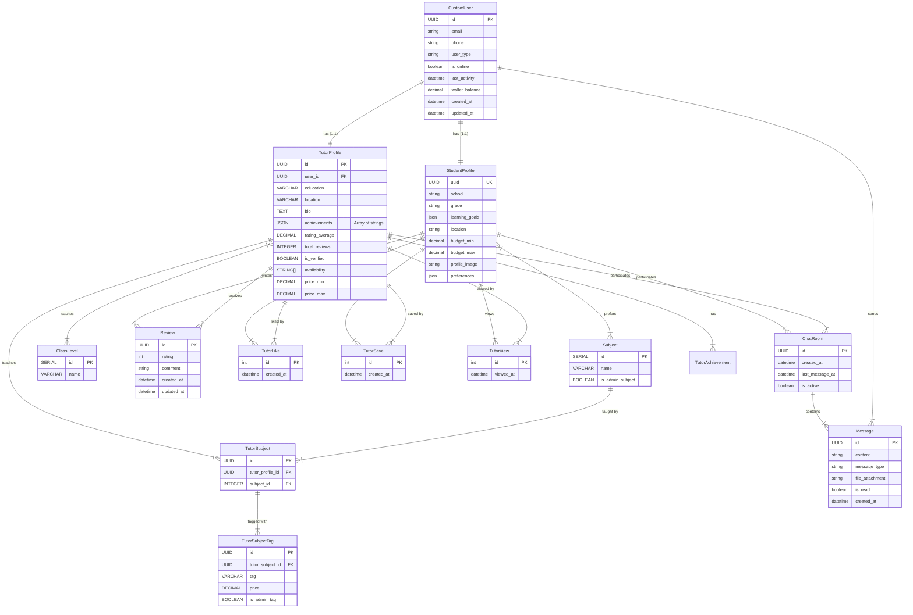

```mermaid
erDiagram
    CustomUser {
        UUID id PK
        string email
        string phone
        string user_type
        boolean is_online
        datetime last_activity
        decimal wallet_balance
        datetime created_at
        datetime updated_at
    }

    StudentProfile {
        UUID uuid UK
        string school
        string grade
        json learning_goals
        string location
        decimal budget_min
        decimal budget_max
        string profile_image
        json preferences
    }

    TutorProfile {
        UUID id PK
        UUID user_id FK
        VARCHAR education
        VARCHAR location
        TEXT bio
        JSON achievements "Array of strings"
        DECIMAL rating_average
        INTEGER total_reviews
        BOOLEAN is_verified
        STRING[] availability
        DECIMAL price_min
        DECIMAL price_max
    }

    Subject {
        SERIAL id PK
        VARCHAR name
        BOOLEAN is_admin_subject
    }

    TutorSubject {
        UUID id PK
        UUID tutor_profile_id FK
        INTEGER subject_id FK
    }

    TutorSubjectTag {
        UUID id PK
        UUID tutor_subject_id FK
        VARCHAR tag
        DECIMAL price
        BOOLEAN is_admin_tag
    }

    ClassLevel {
        SERIAL id PK
        VARCHAR name
    }

    Review {
        UUID id PK
        int rating
        string comment
        datetime created_at
        datetime updated_at
    }

    TutorLike {
        int id PK
        datetime created_at
    }

    TutorSave {
        int id PK
        datetime created_at
    }

    TutorView {
        int id PK
        datetime viewed_at
    }

    ChatRoom {
        UUID id PK
        datetime created_at
        datetime last_message_at
        boolean is_active
    }

    Message {
        UUID id PK
        string content
        string message_type
        string file_attachment
        boolean is_read
        datetime created_at
    }

    %% Relationships
    CustomUser ||--|| StudentProfile : "has (1:1)"
    CustomUser ||--|| TutorProfile : "has (1:1)"

    StudentProfile }|--|{ Subject : "prefers"
    TutorProfile }|--|{ ClassLevel : "teaches"
    
    TutorProfile ||--|{ TutorAchievement : "has"

    TutorProfile ||--|{ TutorSubject : "teaches"
    Subject ||--|{ TutorSubject : "taught by"

    TutorSubject ||--|{ TutorSubjectTag : "tagged with"

    StudentProfile ||--|{ Review : "writes"
    TutorProfile ||--|{ Review : "receives"

    StudentProfile ||--|{ TutorLike : "likes"
    TutorProfile ||--|{ TutorLike : "liked by"

    StudentProfile ||--|{ TutorSave : "saves"
    TutorProfile ||--|{ TutorSave : "saved by"

    StudentProfile ||--|{ TutorView : "views"
    TutorProfile ||--|{ TutorView : "viewed by"

    StudentProfile ||--|{ ChatRoom : "participates"
    TutorProfile ||--|{ ChatRoom : "participates"

    ChatRoom ||--|{ Message : "contains"
    CustomUser ||--|{ Message : "sends"
```
